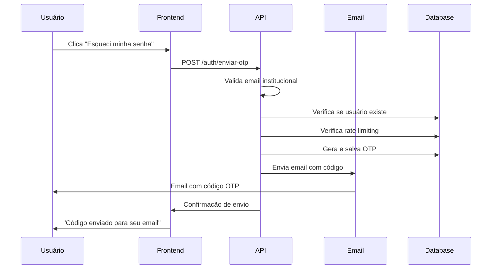
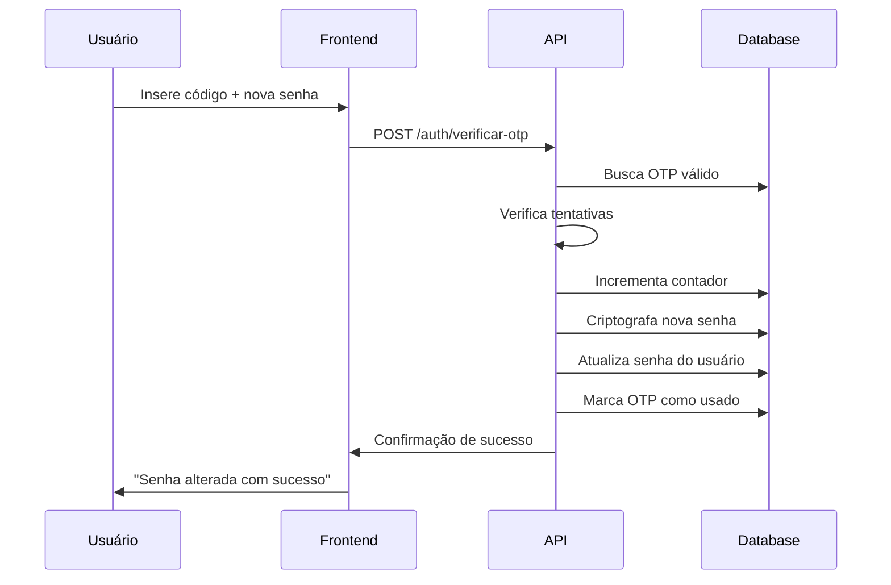

# 🔐 Redefinição de Senha com OTP - Merenda Smart Flow

Esta documentação descreve o fluxo completo de redefinição de senha utilizando códigos OTP (One Time Password) no sistema Merenda Smart Flow.

## 📋 Visão Geral

O sistema de redefinição de senha foi implementado com foco em segurança e usabilidade, permitindo que apenas usuários cadastrados com emails institucionais válidos possam redefinir suas senhas.

### ✨ Características Principais

- ✅ **Validação de Email Institucional**: Apenas domínios autorizados (@edu.muriae.mg.gov.br, etc.)
- ✅ **Códigos OTP de 6 dígitos**: Geração aleatória e segura
- ✅ **Expiração Automática**: Códigos válidos por 15 minutos
- ✅ **Rate Limiting**: Máximo 3 tentativas por hora por usuário
- ✅ **Controle de Tentativas**: Máximo 3 tentativas por código
- ✅ **Logs Detalhados**: Auditoria completa de todas as operações
- ✅ **Emails HTML Estilizados**: Templates profissionais para OTP
- ✅ **Modo Desenvolvimento**: Códigos visíveis nos logs para testes

## 🏗️ Arquitetura do Sistema

### 📊 Estrutura do Banco de Dados

```sql
CREATE TABLE password_reset_otp (
    id_otp UUID PRIMARY KEY DEFAULT gen_random_uuid(),
    id_usuario UUID NOT NULL,              -- FK para usuario
    email_usuario VARCHAR(100) NOT NULL,   -- Email para logs
    codigo_otp VARCHAR(6) NOT NULL,        -- Código de 6 dígitos
    tentativas INTEGER DEFAULT 0,          -- Contador de tentativas
    usado BOOLEAN DEFAULT FALSE,           -- Se já foi utilizado
    data_criacao TIMESTAMP DEFAULT CURRENT_TIMESTAMP,
    data_expiracao TIMESTAMP NOT NULL,     -- Expira em 15 minutos
    
    -- Constraints
    CONSTRAINT fk_password_reset_usuario 
        FOREIGN KEY (id_usuario) REFERENCES usuario(id_usuario) ON DELETE CASCADE,
    CONSTRAINT idx_usuario_otp UNIQUE (id_usuario, codigo_otp)
);
```

### 🔧 Componentes Implementados

1. **Model**: `password-reset-otp.model.ts`
2. **Service**: `otp.service.ts`
3. **Controller**: `otp.controller.ts`
4. **Email Service**: `email-service.ts`
5. **Routes**: Integração com `auth.routes.ts`

## 🛣️ Endpoints da API

### 1. Enviar Código OTP

**POST** `/auth/enviar-otp`

Envia um código OTP para o email do usuário.

#### Corpo da Requisição
```json
{
  "email": "usuario@edu.muriae.mg.gov.br"
}
```

#### Resposta de Sucesso (200)
```json
{
  "status": "sucesso",
  "mensagem": "Código de verificação enviado para usuario@edu.muriae.mg.gov.br. Verifique sua caixa de entrada.",
  "dados": {
    "codigo_gerado": "123456",
    "tempo_expiracao": "15 minutos",
    "email_valido": true
  }
}
```

> **Nota**: O campo `dados` só aparece em ambiente de desenvolvimento.

#### Erros Possíveis
- **400**: Email não fornecido
- **400**: Email com formato inválido
- **400**: Email não autorizado (domínio não institucional)
- **400**: Email não encontrado no sistema
- **400**: Rate limit excedido (máximo 3 por hora)
- **500**: Serviço de email indisponível

### 2. Verificar OTP e Redefinir Senha

**POST** `/auth/verificar-otp`

Verifica o código OTP e redefine a senha do usuário.

#### Corpo da Requisição
```json
{
  "email": "usuario@edu.muriae.mg.gov.br",
  "codigo_otp": "123456",
  "nova_senha": "nova_senha_segura_123"
}
```

#### Resposta de Sucesso (200)
```json
{
  "status": "sucesso",
  "mensagem": "Senha redefinida com sucesso! Você já pode fazer login com sua nova senha."
}
```

#### Erros Possíveis
- **400**: Dados incompletos (email, código ou senha ausentes)
- **400**: Código OTP deve ter 6 dígitos
- **400**: Nova senha deve ter pelo menos 6 caracteres
- **400**: Código inválido ou expirado
- **400**: Código bloqueado por excesso de tentativas
- **400**: Usuário não encontrado

### 3. Endpoints Alternativos (Aliases)

Para compatibilidade e facilidade de uso:

- **POST** `/auth/esqueci-senha` → Alias para `/auth/enviar-otp`
- **POST** `/auth/redefinir-senha` → Alias para `/auth/verificar-otp`

### 4. Endpoints Administrativos

#### Estatísticas do Sistema OTP
**GET** `/auth/otp/stats` (Apenas Admin)

```json
{
  "status": "sucesso",
  "dados": {
    "configuracao": {
      "CODIGO_LENGTH": 6,
      "EXPIRACAO_MINUTOS": 15,
      "MAX_TENTATIVAS": 3,
      "RATE_LIMIT_HORAS": 1,
      "MAX_OTPS_POR_HORA": 3
    },
    "servico_email_ativo": true
  }
}
```

#### Limpeza de OTPs Expirados
**POST** `/auth/otp/limpar-expirados` (Apenas Admin)

```json
{
  "status": "sucesso",
  "mensagem": "15 OTPs expirados removidos com sucesso",
  "dados": { "removidos": 15 }
}
```

## 🔒 Segurança e Validações

### 1. Validação de Email Institucional

```typescript
// Domínios autorizados
const AUTHORIZED_DOMAINS = [
  '@edu.muriae.mg.gov.br',
  '@tec.edu.muriae.mg.gov.br', 
  '@prof.edu.muriae.mg.gov.br'
];

// Regex de validação
const INSTITUTIONAL_EMAIL_REGEX = 
  /^[a-zA-Z0-9._%+-]+@(edu|tec\.edu|prof\.edu)\.muriae\.mg\.gov\.br$/;
```

### 2. Rate Limiting

- **Máximo 3 OTPs por hora** por usuário
- **Verificação por ID do usuário** (não por IP)
- **Contagem resetada a cada hora**

### 3. Controle de Tentativas

- **Máximo 3 tentativas** por código OTP
- **Código bloqueado** após limite excedido
- **Invalidação automática** de códigos usados

### 4. Expiração de Códigos

- **Tempo de vida**: 15 minutos
- **Limpeza automática** de códigos expirados
- **Verificação em tempo real** na validação

## 📧 Sistema de Email

### Configuração

O sistema suporta dois modos:

#### Desenvolvimento
- **Ethereal Email**: Conta de teste automática
- **Preview URLs**: Links para visualizar emails enviados
- **Códigos no log**: Para facilitar testes

#### Produção
- **SMTP customizável** via variáveis de ambiente
- **Templates HTML profissionais**
- **Tratamento de falhas**

### Variáveis de Ambiente

```env
# Email em produção
SMTP_HOST=smtp.servidor.com
SMTP_PORT=587
SMTP_SECURE=false
SMTP_USER=usuario@servidor.com
SMTP_PASS=senha_do_email
SMTP_FROM="Merenda Smart Flow <noreply@merenda.gov.br>"

# Desenvolvimento
NODE_ENV=development  # Usa Ethereal Email automático
```

### Template do Email

O email enviado inclui:

- **Header com branding** do Merenda Smart Flow
- **Código destacado** em vermelho
- **Instruções claras** de uso
- **Tempo de expiração** visível
- **Avisos de segurança**
- **Design responsivo**

## 🔄 Fluxo Completo de Uso

### 1. Usuário Esqueceu a Senha



### 2. Usuário Redefine a Senha



## 🧪 Testes e Desenvolvimento

### Modo Desenvolvimento

Quando `NODE_ENV=development`:

1. **Códigos nos logs**: OTP aparece no console
2. **Ethereal Email**: Emails de teste automáticos
3. **Preview URLs**: Links para visualizar emails
4. **Dados de debug**: Informações extras na resposta

### Testando Manualmente

```bash
# 1. Enviar OTP
curl -X POST http://localhost:3003/auth/enviar-otp \
  -H "Content-Type: application/json" \
  -d '{"email":"usuario@edu.muriae.mg.gov.br"}'

# 2. Verificar nos logs do servidor o código gerado

# 3. Redefinir senha
curl -X POST http://localhost:3003/auth/verificar-otp \
  -H "Content-Type: application/json" \
  -d '{
    "email":"usuario@edu.muriae.mg.gov.br",
    "codigo_otp":"123456",
    "nova_senha":"nova_senha_123"
  }'
```

## 📝 Logs e Auditoria

### Eventos Logados

- ✅ **Envio de OTP**: Email, sucesso/falha
- ✅ **Verificação de OTP**: Tentativas, sucessos, falhas
- ✅ **Rate limiting**: Bloqueios por excesso
- ✅ **Emails inválidos**: Tentativas não autorizadas
- ✅ **Alterações de senha**: Confirmações
- ✅ **Limpeza automática**: OTPs removidos

### Formato dos Logs

```
2025-07-04 12:30:00 📝 [OTP] Iniciando processo de envio de OTP para: usuario@edu.muriae.mg.gov.br
2025-07-04 12:30:01 📝 [OTP] OTP criado com ID: uuid-123
2025-07-04 12:30:02 📝 [OTP] OTP enviado com sucesso para usuario@edu.muriae.mg.gov.br
2025-07-04 12:35:00 📝 [OTP] Redefinição de senha concluída para usuario@edu.muriae.mg.gov.br
```

## ⚡ Performance e Otimizações

### Índices de Banco

```sql
-- Otimizações implementadas
CREATE INDEX idx_password_reset_id_usuario ON password_reset_otp(id_usuario);
CREATE INDEX idx_password_reset_data_expiracao ON password_reset_otp(data_expiracao);
```

### Limpeza Automática

- **Rotina de limpeza** para OTPs expirados
- **Cascade delete** quando usuário é removido
- **Invalidação em lote** para novos OTPs

## 🚀 Implantação em Produção

### Pré-requisitos

1. **Configurar SMTP** nas variáveis de ambiente
2. **Executar migration** 009_create_password_reset_otp_table.sql
3. **Definir NODE_ENV=production**
4. **Configurar domínio de email** em SMTP_FROM

### Checklist de Produção

- [ ] Variáveis SMTP configuradas
- [ ] Tabela `password_reset_otp` criada
- [ ] Teste de envio de email funcionando
- [ ] Logs de auditoria ativos
- [ ] Rotina de limpeza agendada (opcional)

## 🔧 Manutenção

### Comandos Úteis

```sql
-- Ver OTPs ativos
SELECT * FROM password_reset_otp WHERE usado = false AND data_expiracao > NOW();

-- Limpar OTPs expirados manualmente
DELETE FROM password_reset_otp WHERE data_expiracao <= NOW() OR usado = true;

-- Estatísticas de uso
SELECT 
  DATE(data_criacao) as data,
  COUNT(*) as total_otps,
  COUNT(CASE WHEN usado THEN 1 END) as utilizados
FROM password_reset_otp 
GROUP BY DATE(data_criacao) 
ORDER BY data DESC;
```

### Monitoramento

- **Taxa de sucesso** de envio de emails
- **Tempo de resposta** dos endpoints
- **Tentativas de ataques** (rate limiting)
- **Volume de OTPs** por período

---

## 📞 Suporte

Para dúvidas sobre implementação ou problemas:
- 📖 Consulte logs detalhados no servidor
- 🔧 Verifique configurações SMTP
- 📧 Teste com Ethereal em desenvolvimento

**Sistema implementado com sucesso! 🎉**
