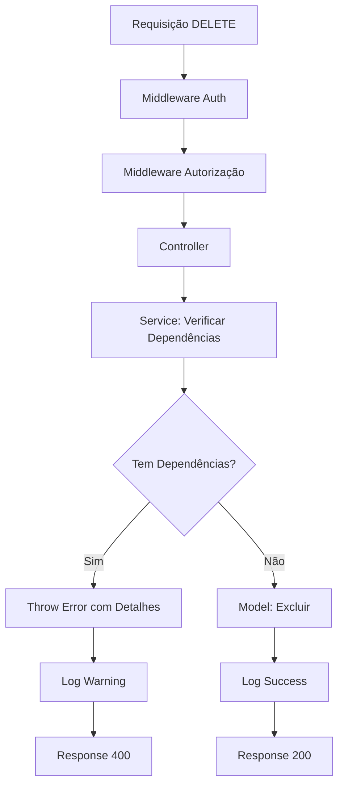

# 🛡️ Validações de Integridade Referencial - Merenda Smart Flow

## 📖 **Visão Geral**

Este documento especifica as validações de integridade referencial implementadas no sistema Merenda Smart Flow para garantir que exclusões não quebrem relacionamentos críticos entre entidades.

## 🎯 **Objetivo**

- **Prevenir** exclusões que causariam inconsistências no banco de dados
- **Informar** ao usuário sobre dependências existentes com detalhes específicos
- **Manter** a integridade dos dados em todas as operações
- **Melhorar** a experiência do usuário com mensagens claras de erro

## 🏗️ **Arquitetura das Validações**

### **Padrão Implementado:**
1. **Service Layer**: Contém a lógica de validação antes de chamar o model
2. **Verificação Prévia**: Consulta dependências antes de tentar excluir
3. **Mensagens Específicas**: Informa quantos registros impedem a exclusão
4. **Logs Detalhados**: Registra todas as tentativas de exclusão
5. **Rollback Automático**: Em caso de erro, nenhuma alteração é feita

## 📊 **Entidades e Suas Validações**

### **1. FORNECEDOR** 🏪

**Regra de Negócio:**
- Fornecedores **NÃO** podem ser excluídos se possuem itens vinculados
- Apenas **ADMIN** e **NUTRICIONISTA** podem excluir fornecedores
- Validação aplica-se independentemente do perfil do usuário

**Dependências Verificadas:**
- ✅ Tabela `item` → campo `id_fornecedor`

**Cenários de Teste:**
- ❌ Fornecedor com 5 itens → "Não é possível excluir fornecedor. Existem 5 itens vinculados a este fornecedor."
- ✅ Fornecedor sem itens → Exclusão permitida

---

### **2. ITEM** 📦

**Regra de Negócio:**
- Itens **NÃO** podem ser excluídos se existem registros de estoque
- **ADMIN**, **NUTRICIONISTA** e **ESCOLA** podem excluir itens
- Validação aplica-se independentemente do perfil do usuário

**Dependências Verificadas:**
- ✅ Tabela `estoque` → campo `id_item`

**Cenários de Teste:**
- ❌ Item presente em 3 estoques → "Não é possível excluir item. Existem 3 registros de estoque para este item."
- ✅ Item sem estoque → Exclusão permitida

---

### **3. ESCOLA** 🏫

**Regra de Negócio:**
- Escolas **NÃO** podem ser excluídas se possuem:
  - Registros de estoque
  - Segmentos vinculados
- Apenas **ADMIN** pode excluir escolas
- Validação aplica-se independentemente do perfil do usuário

**Dependências Verificadas:**
- ✅ Tabela `estoque` → campo `id_escola`
- ✅ Tabela `escola_segmento` → campo `id_escola`

**Cenários de Teste:**
- ❌ Escola com estoque → "Não é possível excluir escola. Existem 15 registros de estoque para esta escola."
- ❌ Escola com segmentos → "Não é possível excluir escola. Existem 3 segmentos vinculados a esta escola."
- ✅ Escola sem dependências → Exclusão permitida

---

### **4. SEGMENTO** 📋

**Regra de Negócio:**
- Segmentos **NÃO** podem ser excluídos se possuem:
  - Escolas vinculadas
  - Registros de estoque
- Apenas **ADMIN** e **NUTRICIONISTA** podem excluir segmentos
- Validação aplica-se independentemente do perfil do usuário

**Dependências Verificadas:**
- ✅ Tabela `escola_segmento` → campo `id_segmento`
- ✅ Tabela `estoque` → campo `id_segmento`

**Cenários de Teste:**
- ❌ Segmento com escolas → "Não é possível excluir segmento. Existem 8 escolas vinculadas a este segmento."
- ❌ Segmento com estoque → "Não é possível excluir segmento. Existem 25 registros de estoque para este segmento."
- ✅ Segmento sem dependências → Exclusão permitida

---

### **5. PERÍODO DE LANÇAMENTO** 📅

**Regra de Negócio:**
- Períodos **NÃO** podem ser excluídos se possuem registros de estoque
- Apenas **ADMIN** pode excluir períodos
- Período ativo **NUNCA** pode ser excluído

**Dependências Verificadas:**
- ✅ Tabela `estoque` → campo `id_periodo`
- ✅ Campo `ativo` → não pode ser `true`

**Cenários de Teste:**
- ❌ Período ativo → "Não é possível excluir período ativo."
- ❌ Período com estoque → "Não é possível excluir período. Existem 50 registros de estoque para este período."
- ✅ Período inativo sem estoque → Exclusão permitida

## 🔧 **Implementação Técnica**

### **Estrutura dos Services:**

```typescript
export const excluir[Entidade] = async (id: string): Promise<void> => {
  try {
    logger.info(`Verificando se [entidade] ${id} pode ser excluída`);
    
    // 1. Verificar dependências (uma por vez)
    const dependencia1 = await verificarDependencia1(id);
    if (dependencia1.total > 0) {
      throw new Error(`Mensagem específica com quantidade: ${dependencia1.total}`);
    }
    
    const dependencia2 = await verificarDependencia2(id);
    if (dependencia2.total > 0) {
      throw new Error(`Mensagem específica com quantidade: ${dependencia2.total}`);
    }
    
    // 2. Se passou nas validações, excluir
    const resultado = await Model.excluir(id);
    if (!resultado) {
      throw new Error('[Entidade] não encontrada');
    }
    
    logger.success(`[Entidade] ${id} excluída com sucesso`);
    
  } catch (error) {
    logger.error(`Erro ao excluir [entidade]: ${error.message}`);
    throw error;
  }
};
```

### **Padrão de Mensagens:**

```typescript
// ❌ Mensagens de Erro (Constraint Violation)
"Não é possível excluir [entidade]. Existem [X] [dependências] vinculadas a esta [entidade]."

// ✅ Mensagens de Sucesso  
"[Entidade] excluída com sucesso"

// ⚠️ Mensagens de Aviso (Logs)
"[Entidade] possui [X] [dependências] vinculadas"
```

## 📋 **Checklist de Implementação**

### **Fase 1: Fornecedor**
- [ ] Implementar validação no service
- [ ] Adicionar função no controller
- [ ] Atualizar rotas com validação
- [ ] Testes unitários
- [ ] Documentar endpoint

### **Fase 2: Item**
- [ ] Implementar validação no service
- [ ] Adicionar função no controller  
- [ ] Atualizar rotas com validação
- [ ] Testes unitários
- [ ] Documentar endpoint

### **Fase 3: Escola**
- [ ] Implementar validação no service
- [ ] Adicionar função no controller
- [ ] Atualizar rotas com validação
- [ ] Testes unitários
- [ ] Documentar endpoint

### **Fase 4: Segmento**
- [ ] Implementar validação no service
- [ ] Adicionar função no controller
- [ ] Atualizar rotas com validação
- [ ] Testes unitários
- [ ] Documentar endpoint

### **Fase 5: Período**
- [ ] Implementar validação no service
- [ ] Adicionar função no controller
- [ ] Atualizar rotas com validação
- [ ] Testes unitários
- [ ] Documentar endpoint

## 🧪 **Estratégia de Testes**

### **Testes de Constraint (Para cada entidade):**

1. **Teste Positivo**: Exclusão sem dependências → Sucesso
2. **Teste Negativo**: Exclusão com dependências → Erro específico
3. **Teste de Autorização**: Perfis corretos → Permitido / Perfis incorretos → Negado
4. **Teste de Entidade Inexistente**: ID inválido → "Entidade não encontrada"

### **Exemplos de Casos de Teste:**

```bash
# Teste 1: Fornecedor com itens
curl -X DELETE /api/fornecedores/123 -H "Authorization: Bearer token"
# Esperado: 400 - "Não é possível excluir fornecedor. Existem 5 itens vinculados a este fornecedor."

# Teste 2: Fornecedor sem itens  
curl -X DELETE /api/fornecedores/999 -H "Authorization: Bearer token"
# Esperado: 200 - "Fornecedor excluído com sucesso"
```

## 📊 **Métricas e Monitoramento**

### **Logs Capturados:**
- ✅ Tentativas de exclusão (sucesso/erro)
- ✅ Quantidade de dependências encontradas
- ✅ Perfil do usuário que tentou a exclusão
- ✅ Timestamp e duração da operação

### **Alertas:**
- 🚨 Multiple tentativas de exclusão com constraint violation
- 🚨 Tentativas de exclusão por perfis não autorizados
- 🚨 Errors inesperados durante validação

## 🔄 **Fluxo de Execução**



## 📝 **Notas de Desenvolvimento**

### **Boas Práticas:**
- ✅ **Sempre** verificar dependências antes de excluir
- ✅ **Sempre** usar transações quando necessário
- ✅ **Sempre** retornar mensagens específicas com quantidades
- ✅ **Sempre** logar tentativas de exclusão
- ✅ **Nunca** excluir sem validação prévia

### **Performance:**
- ⚡ Usar `COUNT(*)` ao invés de `SELECT *` para verificações
- ⚡ Indexar campos de relacionamento (`id_fornecedor`, `id_item`, etc.)
- ⚡ Fazer verificações em paralelo quando possível
- ⚡ Cache de validações para entidades frequentemente verificadas

---

**Data de Criação:** 01/07/2025  
**Versão:** 1.0  
**Autor:** Sistema Merenda Smart Flow  
**Status:** 📋 Documentado - Pronto para Implementação
