# 🛡️ Validações de Integridade Referencial - Merenda Smart Flow

## 📖 **Visão Geral**

Este documento especifica as validações de integridade referencial implementadas no sistema Merenda Smart Flow para garantir que exclusões não quebrem relacionamentos críticos entre entidades.

## 🎯 **Objetivo**

- **Prevenir** exclusões que causariam inconsistências no banco de dados
- **Informar** ao usuário sobre dependências existentes com detalhes específicos
- **Manter** a integridade dos dados em todas as operações
- **Melhorar** a experiência do usuário com mensagens claras de erro

## 🏗️ **Arquitetura das Validações**

### **Padrão Implementado:**
1. **Service Layer**: Contém a lógica de validação antes de chamar o model
2. **Verificação Prévia**: Consulta dependências antes de tentar excluir
3. **Mensagens Específicas**: Informa quantos registros impedem a exclusão
4. **Logs Detalhados**: Registra todas as tentativas de exclusão
5. **Rollback Automático**: Em caso de erro, nenhuma alteração é feita

## 📊 **Entidades e Suas Validações**

### **1. FORNECEDOR** 🏪

**Regra de Negócio:**
- Fornecedores **NÃO** podem ser excluídos se possuem itens vinculados
- Apenas **ADMIN** e **NUTRICIONISTA** podem excluir fornecedores
- Validação aplica-se independentemente do perfil do usuário

**Dependências Verificadas:**
- ✅ Tabela `item` → campo `id_fornecedor`

**Cenários de Teste:**
- ❌ Fornecedor com 5 itens → "Não é possível excluir fornecedor. Existem 5 itens vinculados a este fornecedor."
- ✅ Fornecedor sem itens → Exclusão permitida

---

### **2. ITEM** 📦

**Regra de Negócio:**
- Itens **NÃO** podem ser excluídos se existem registros de estoque
- **ADMIN**, **NUTRICIONISTA** e **ESCOLA** podem excluir itens
- Validação aplica-se independentemente do perfil do usuário

**Dependências Verificadas:**
- ✅ Tabela `estoque` → campo `id_item`

**Cenários de Teste:**
- ❌ Item presente em 3 estoques → "Não é possível excluir item. Existem 3 registros de estoque para este item."
- ✅ Item sem estoque → Exclusão permitida

---

### **3. ESCOLA** 🏫

**Regra de Negócio:**
- Escolas **NÃO** podem ser excluídas se possuem:
  - Registros de estoque
  - Segmentos vinculados
- Apenas **ADMIN** pode excluir escolas
- Validação aplica-se independentemente do perfil do usuário

**Dependências Verificadas:**
- ✅ Tabela `estoque` → campo `id_escola`
- ✅ Tabela `escola_segmento` → campo `id_escola`

**Cenários de Teste:**
- ❌ Escola com estoque → "Não é possível excluir escola. Existem 15 registros de estoque para esta escola."
- ❌ Escola com segmentos → "Não é possível excluir escola. Existem 3 segmentos vinculados a esta escola."
- ✅ Escola sem dependências → Exclusão permitida

---

### **4. SEGMENTO** 📋

**Regra de Negócio:**
- Segmentos **NÃO** podem ser excluídos se possuem:
  - Escolas vinculadas
  - Registros de estoque
- Apenas **ADMIN** e **NUTRICIONISTA** podem excluir segmentos
- Validação aplica-se independentemente do perfil do usuário

**Dependências Verificadas:**
- ✅ Tabela `escola_segmento` → campo `id_segmento`
- ✅ Tabela `estoque` → campo `id_segmento`

**Cenários de Teste:**
- ❌ Segmento com escolas → "Não é possível excluir segmento. Existem 8 escolas vinculadas a este segmento."
- ❌ Segmento com estoque → "Não é possível excluir segmento. Existem 25 registros de estoque para este segmento."
- ✅ Segmento sem dependências → Exclusão permitida

---

### **5. PERÍODO DE LANÇAMENTO** 📅

**Regra de Negócio:**
- Períodos **NÃO** podem ser excluídos se possuem registros de estoque
- Apenas **ADMIN** pode excluir períodos
- Período ativo **NUNCA** pode ser excluído

**Dependências Verificadas:**
- ✅ Tabela `estoque` → campo `id_periodo`
- ✅ Campo `ativo` → não pode ser `true`

**Cenários de Teste:**
- ❌ Período ativo → "Não é possível excluir um período ativo. Desative o período antes de excluí-lo."
- ❌ Período com estoque → "Não é possível excluir período. Existem 50 registros de estoque vinculados a este período."
- ✅ Período inativo sem estoque → Exclusão permitida

## 🔧 **Implementação Técnica**

### **Estrutura dos Services:**

```typescript
export const excluir[Entidade] = async (id: string): Promise<void> => {
  try {
    logger.info(`Verificando se [entidade] ${id} pode ser excluída`);
    
    // 1. Verificar se a entidade existe
    const entidade = await [Entidade]Model.buscarPorId(id);
    if (!entidade) {
      throw new NotFoundError('[Entidade] não encontrada');
    }
    
    // 2. Verificar dependências (uma por vez para erro específico)
    const dependenciasCount = await connection('tabela_dependencia')
      .where('id_entidade', id)
      .count('* as total')
      .first();
    
    const totalDependencias = Number(dependenciasCount?.total || 0);
    
    if (totalDependencias > 0) {
      logger.warning(`[Entidade] ${id} possui ${totalDependencias} dependências`);
      throw new ConstraintViolationError(
        `Não é possível excluir [entidade]. Existem ${totalDependencias} [dependências] vinculadas.`,
        {
          entidade: '[entidade]',
          id: id,
          dependencias: {
            [tipo_dependencia]: totalDependencias
          }
        }
      );
    }
    
    // 3. Se passou nas validações, excluir
    await [Entidade]Model.excluir(id);
    
    logger.success(`[Entidade] ${entidade.nome} (${id}) excluída com sucesso`);
    
  } catch (error) {
    if (error instanceof NotFoundError || error instanceof ConstraintViolationError) {
      // Re-throw errors customizados para serem tratados no controller
      throw error;
    }
    
    logger.error(`Erro ao excluir [entidade]: ${error.message}`);
    throw new Error(`Erro interno: ${error.message}`);
  }
};
```

### **Padrão de Mensagens e Erros:**

```typescript
// ❌ Constraint Violation (ConstraintViolationError)
"Não é possível excluir [entidade]. Existem [X] [dependências] vinculadas a esta [entidade]."

// ❌ Not Found (NotFoundError)
"[Entidade] não encontrada"

// ❌ Invalid State (InvalidStateError) - para períodos ativos
"Não é possível excluir um período ativo. Desative o período antes de excluí-lo."

// ✅ Mensagens de Sucesso  
"[Entidade] excluída com sucesso"

// ⚠️ Mensagens de Logs
"Verificando se [entidade] [id] pode ser excluída"
"[Entidade] [nome] ([id]) excluída com sucesso"
"[Entidade] possui [X] [dependências] vinculadas"
```

### **Estrutura de Response Padronizada:**

```typescript
// Success Response (200)
{
  "status": "sucesso",
  "mensagem": "[Entidade] excluída com sucesso",
  "dados": {
    "id_[entidade]": "uuid",
    "excluido_em": "2025-07-02T10:30:00.000Z"
  }
}

// Error Response (400/404)
{
  "status": "erro",
  "mensagem": "Mensagem específica do erro",
  "codigo": "CONSTRAINT_VIOLATION|NOT_FOUND|INVALID_STATE",
  "detalhes": {
    "entidade": "nome_da_entidade",
    "id": "uuid",
    "dependencias": {
      "tipo_dependencia": quantidade
    }
  },
  "timestamp": "2025-07-02T10:30:00.000Z"
}
```

## 📋 **Checklist de Implementação**

### **Fase 1: Fornecedor** ✅
- [x] Implementar validação no service
- [x] Adicionar função no controller
- [x] Atualizar rotas com validação
- [x] Testes manuais realizados
- [x] Documentar endpoint

### **Fase 2: Item** ✅
- [x] Implementar validação no service
- [x] Adicionar função no controller  
- [x] Atualizar rotas com validação
- [x] Testes manuais realizados
- [x] Documentar endpoint

### **Fase 3: Escola** ✅
- [x] Implementar validação no service
- [x] Adicionar função no controller
- [x] Atualizar rotas com validação
- [x] Testes manuais realizados
- [x] Documentar endpoint

### **Fase 4: Segmento** ✅
- [x] Implementar validação no service
- [x] Adicionar função no controller
- [x] Atualizar rotas com validação
- [x] Testes manuais realizados
- [x] Documentar endpoint

### **Fase 5: Período** ✅
- [x] Implementar validação no service
- [x] Adicionar função no controller
- [x] Atualizar rotas com validação
- [x] Testes manuais realizados
- [x] Documentar endpoint

## 🧪 **Estratégia de Testes**

### **Testes de Constraint (Para cada entidade):**

1. **Teste Positivo**: Exclusão sem dependências → Sucesso
2. **Teste Negativo**: Exclusão com dependências → Erro específico
3. **Teste de Autorização**: Perfis corretos → Permitido / Perfis incorretos → Negado
4. **Teste de Entidade Inexistente**: ID inválido → "Entidade não encontrada"

### **Exemplos de Casos de Teste:**

```bash
# Teste 1: Fornecedor com itens
curl -X DELETE /api/fornecedores/123 -H "Authorization: Bearer token"
# Esperado: 400 - "Não é possível excluir fornecedor. Existem 5 itens vinculados a este fornecedor."

# Teste 2: Fornecedor sem itens  
curl -X DELETE /api/fornecedores/999 -H "Authorization: Bearer token"
# Esperado: 200 - "Fornecedor excluído com sucesso"
```

## 📊 **Métricas e Monitoramento**

### **Logs Capturados:**
- ✅ Tentativas de exclusão (sucesso/erro)
- ✅ Quantidade de dependências encontradas
- ✅ Perfil do usuário que tentou a exclusão
- ✅ Timestamp e duração da operação

### **Alertas:**
- 🚨 Multiple tentativas de exclusão com constraint violation
- 🚨 Tentativas de exclusão por perfis não autorizados
- 🚨 Errors inesperados durante validação

## 🔄 **Fluxo de Execução**

```mermaid
graph TD
    A[Requisição DELETE] --> B[Middleware Auth]
    B --> C[Middleware Autorização]  
    C --> D[Controller]
    D --> E[Service: Verificar Dependências]
    E --> F{Tem Dependências?}
    F -->|Sim| G[Throw Error com Detalhes]
    F -->|Não| H[Model: Excluir]
    H --> I[Log Success]
    G --> J[Log Warning]
    I --> K[Response 200]
    J --> L[Response 400]
```



## 📝 **Notas de Desenvolvimento**

### **Boas Práticas:**
- ✅ **Sempre** verificar dependências antes de excluir
- ✅ **Sempre** usar transações quando necessário
- ✅ **Sempre** retornar mensagens específicas com quantidades
- ✅ **Sempre** logar tentativas de exclusão
- ✅ **Nunca** excluir sem validação prévia

### **Performance:**
- ⚡ Usar `COUNT(*)` ao invés de `SELECT *` para verificações
- ⚡ Indexar campos de relacionamento (`id_fornecedor`, `id_item`, etc.)
- ⚡ Fazer verificações em paralelo quando possível
- ⚡ Cache de validações para entidades frequentemente verificadas

## 📋 **Resumo da Implementação Realizada**

### **✅ Validações Implementadas:**
1. **Fornecedor**: Verifica itens vinculados antes da exclusão
2. **Item**: Verifica registros de estoque antes da exclusão  
3. **Escola**: Verifica estoque e segmentos vinculados antes da exclusão
4. **Segmento**: Verifica escolas e estoque vinculados antes da exclusão
5. **Período**: Verifica se está ativo e se tem estoque vinculado antes da exclusão

### **✅ Classes de Erro Customizadas:**
- `NotFoundError`: Entidade não encontrada
- `ConstraintViolationError`: Violação de integridade referencial
- `InvalidStateError`: Estado inválido para operação
- `ForbiddenError`: Falta de autorização

### **✅ Padrão de Resposta Padronizado:**
- Responses JSON estruturadas com status, mensagem, código e timestamp
- Detalhes específicos sobre dependências encontradas
- Logs detalhados para auditoria e monitoramento

### **✅ Testes Realizados:**
- Cenários de sucesso (exclusão sem dependências)
- Cenários de erro (exclusão com dependências)
- Cenários de autorização (perfis corretos/incorretos)
- Cenários de entidade inexistente

---

**Data de Criação:** 01/07/2025  
**Última Revisão:** 02/07/2025  
**Versão:** 1.1  
**Autor:** Sistema Merenda Smart Flow  
**Status:** ✅ Implementado e Testado
